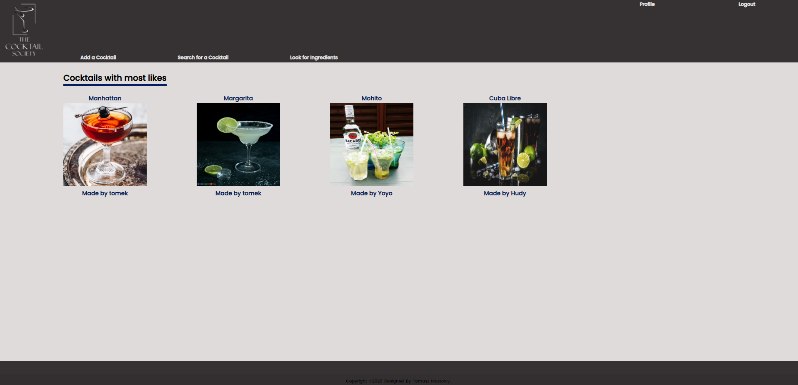

Infused Cocktail Webb App 2.0

# Cocktail_Society

Created a web-app where a user can login.
User can add cocktails with picure and all ingreditns needed to make one.
User can view others uses's added cocktails.
User can search and view cocktials details.

Technologies Used:
Python 3.8
Django 3.1
CSS
HTML
---
Register page.

Login page.

Home Page with top 5 cocktails with most likes.

Page when users can add their own cocktails.

Search for a cocktail by name, ingredient it contains or by category.

Search results, cocktails contains 'rum' in database.

Cocktails added by login/selected user.

Cocktail details contains all needed informations with likes system and if user added this cocktail, cocktail can be delated.

